---
Hi! 👋 My name is **Joaquin Galang**, a fourth-year Computer Science student from Holy Angel University and an aspiring professional software developer. I enjoy creating fun and interesting applications, coding challenges, and teaching beginners how to code.  

<h3 align="center">✨🔨<b><i> Let's build cool stuff together </i></b>👾✨</h3>

---

---

---

