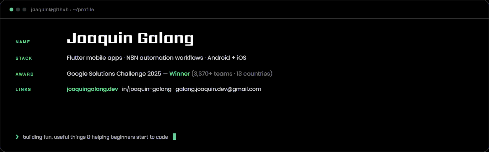

---

Hi, my name is **Joaquin Galang**, a software developer based in the Philippines. I build Flutter mobile apps and N8N automation workflows, and I've put together 20+ Flutter applications for Android and iOS. In 2025 my team won the Google Solutions Challenge with TrashTrackr, competing against 3,370+ teams across 13 countries.

Right now I'm building **TrustMop**, a home-cleaning booking service, and **Marahuyo Studios**, an automation and software agency. I enjoy building fun and useful applications, working through coding challenges, and helping beginners get started with code.

Portfolio: [joaquingalang.dev](https://joaquingalang.dev)

<h4 align="center"><b><i>Let's build cool stuff together</i></b></h4>

---

---

---

